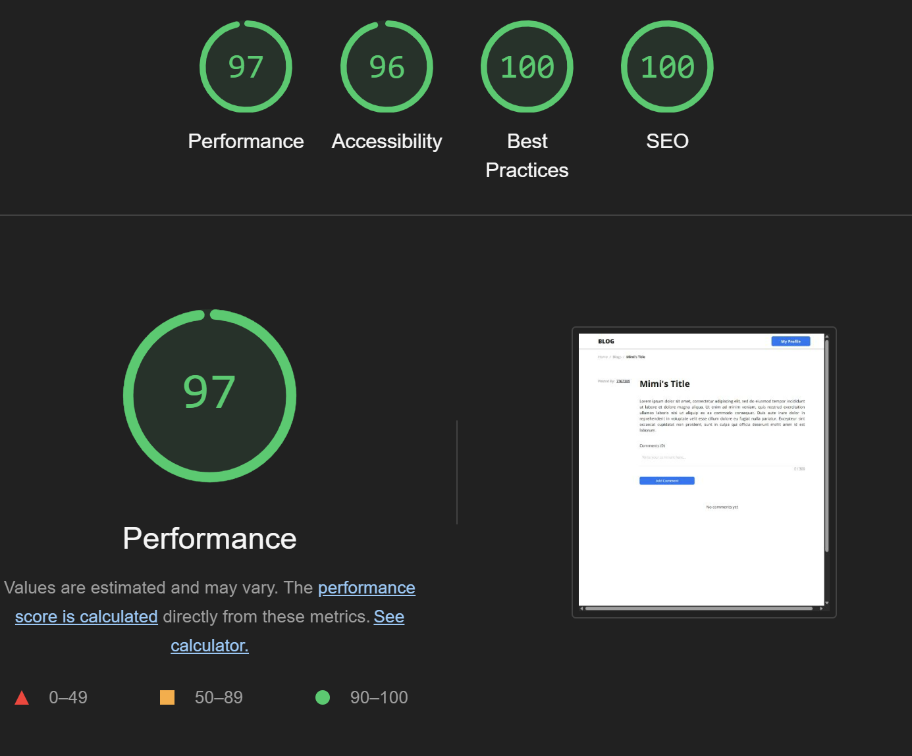
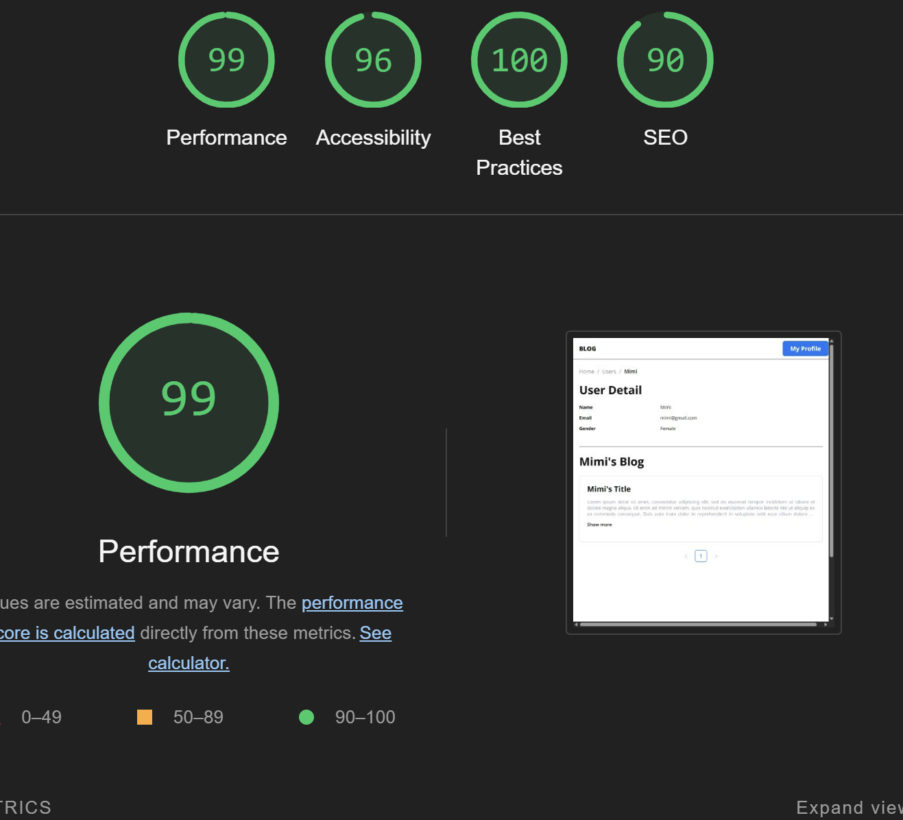

# Blog Application

## Web link

https://blog-project-ten-mu.vercel.app/

## Overview

This is a blog website built with **Next.js (Page Router) and TypeScript**. The app fetches and displays blog data from the **GoRest API** and includes full CRUD functionality without page refresh. The UI is designed using **Tailwind CSS and Ant Design** while API calls are managed using **Axios and TanStack Query (v5)**.

## Features

- Fetch and display blog list with pagination without page refresh.
- Fetch and display user profile.
- Fetch and display user blog list.
- Fetch and display blog detail and its comments.
- Add comment to blog post.
- Create, update, and delete blog posts without page refresh.
- Create, update user profile.
- Responsive and well-optimized UI.
- Uses **Server-Side Rendering (SSR)** for better performance and hydrate to client.
- **Error handling** to ensure a smooth experience.
- **Secure authentication** using cookies.
- Add middleware for path security

## Tech Stack

- **Next.js 13 (Page Router)**
- **TypeScript**
- **Axios**
- **TanStack Query v5**
- **Tailwind CSS v4**
- **Ant Design v5**
- **React Icons**
- **Cookies Next**

## Best Practices Implemented

✔️ Code structured following best practices.
✔️ Error handling and user-friendly messages.
✔️ No console errors or warnings.
✔️ Responsive and accessible UI.

## Performance

These performance were tested with Lighthouse for pages that need data from Go Rest API.

### Home Page Performance

### Blog Detail Page Performance

### User Detail Page Performance

